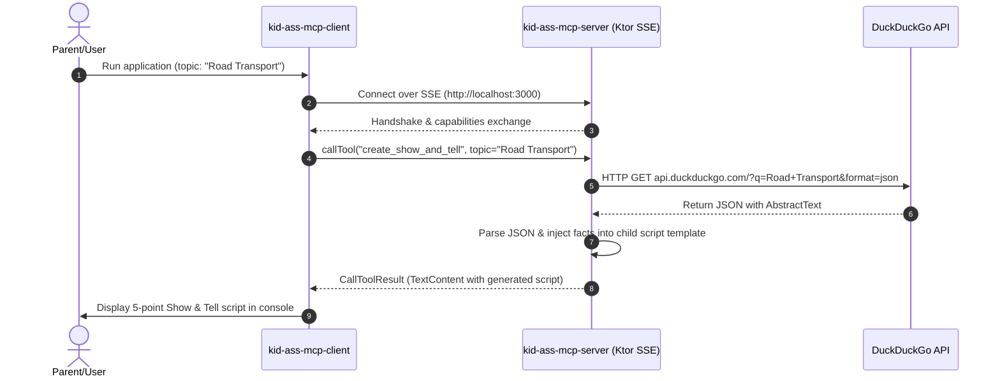

# Show and Tell MCP Assistant — Technical Deep Dive & Use Case

## 📋 Use Case Summary

The **Show and Tell MCP Assistant** is a decoupled, multi-project Kotlin application designed to help parents generate structured, age-appropriate speaking scripts for children's school assignments. 

By leveraging the **Model Context Protocol (MCP)**, the system cleanly separates concerns:
- **Client Application**: Requests assistance for a given topic (e.g., `"Road Transport"`).
- **Remote Kotlin Server**: Dynamically orchestrates content generation on demand.

Rather than relying on rigid static templates, the server fetches live factual data from external web APIs (such as DuckDuckGo Instant Answer API) and structures it into simple, engaging talking points tailored specifically for young students.

---

## 🛠️ Technical Implementation Details

### 1. Architecture & Transport
- **Decoupled Multi-Project Setup**: Built as two independent Gradle projects:
  - `kid-ass-mcp-server`: Standalone backend running an MCP server over HTTP/SSE.
  - `kid-ass-mcp-client`: Lightweight client that connects to the server, discovers capabilities, and invokes tools.
- **Protocol**: Communicates seamlessly using the official [Kotlin MCP SDK](https://github.com/modelcontextprotocol/kotlin-sdk) (`v0.7.2`) over **Server-Sent Events (SSE)** at `http://localhost:3000`.

### 2. Technology Stack
- **Language**: Kotlin `2.1.0`
- **JDK**: Java 21+
- **HTTP Engine**: Ktor `3.0.0`
  - **Server Engine**: Ktor Netty & Ktor SSE (`io.ktor:ktor-server-netty`, `io.ktor:ktor-server-sse`)
  - **Client Engine**: Ktor CIO (`io.ktor:ktor-client-cio`)
- **Serialization & Parsing**: `kotlinx.serialization` (`1.7.3`) for network communication and JSON payload processing.
- **Logging**: Logback Classic (`1.5.12`).

---

## 🔄 Interaction & Data Flow

---

## 💡 Key Highlights & Design Patterns

1. **Dynamic Server-Side Orchestration**:
   The MCP tool (`create_show_and_tell`) accepts arbitrary input arguments (`topic`), executes asynchronous outbound HTTP requests via Ktor client, and parses live JSON responses to enrich the final script template with actual facts.

2. **Resilient Fallback Handling**:
   If external API requests fail or network issues arise, the server gracefully falls back to structured template generation without breaking the MCP contract.

3. **Standardized Protocol Extension**:
   Demonstrates how custom domain-specific tools (education, content generation) can be cleanly exposed using MCP standards in Kotlin.
